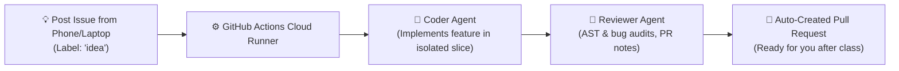

# 🚀 Autonomous Multi-Agent Hobby Project Incubator ($0 Budget)

An automated incubator designed for students to generate, review, and test hobby projects while away in class using **GitHub Actions** and **Google Gemini Free Tier**.

---

## 🏗️ How It Works



1. **You drop an idea into a GitHub Issue** (e.g. from GitHub Mobile on your phone during class) and add the label `idea`.
2. **GitHub Actions wakes up in the cloud** for free (runs even if your laptop is closed in your bag).
3. **Context-Isolation Engine** reads `ARCHITECTURE.md` and only injects the relevant minimal interface (preventing context overload).
4. **Coder Agent** writes the feature in its own directory (`src/features/<new_feature>/`).
5. **Reviewer Agent** verifies Python AST syntax, checks logic, and drafts a PR walkthrough.
6. **Pull Request is created** automatically with a summary comment on your issue.

---

## ⚡ Setup in 3 Minutes

### 1. Push to Your GitHub Repository
```bash
git init
git add .
git commit -m "feat: initial multi-agent incubator setup"
git branch -M main
git remote add origin https://github.com/<YOUR_USERNAME>/<YOUR_REPO_NAME>.git
git push -u origin main
```

### 2. Add Your Free Gemini API Key to GitHub Secrets
1. Grab a free API key from [Google AI Studio](https://aistudio.google.com/).
2. In your GitHub repository, navigate to:
   **Settings** $\rightarrow$ **Secrets and variables** $\rightarrow$ **Actions** $\rightarrow$ **New repository secret**.
3. Set Name: `GEMINI_API_KEY`
4. Set Value: `<paste your key>`

### 3. Grant Workflow PR Permissions
In GitHub:
1. Go to **Settings** $\rightarrow$ **Actions** $\rightarrow$ **General**.
2. Scroll to **Workflow permissions**:
   - Select **Read and write permissions**.
   - Check **Allow GitHub Actions to create and approve pull requests**.
3. Click **Save**.

---

## 📱 How to Use While in Class

1. Open the **GitHub Mobile app** or browser.
2. Go to your repo $\rightarrow$ **Issues** $\rightarrow$ **New Issue**.
   - **Title**: `CLI Pomodoro Timer`
   - **Body**: `A terminal timer with work and break intervals, sound alert, and persistent stats.`
   - **Label**: `idea`
3. Hit submit! The workflow will run, test, and open a Pull Request ready for you to review and merge after class.

---

## 💻 Local Testing & Development

### Run Test Suite
```bash
pytest tests/ -v
```

### Run the CLI
```bash
# List available features
python3 main.py --help

# Test sample notes feature
python3 main.py notes add --title "Lecture Notes" --content "Chapter 4 algorithms"
python3 main.py notes list
```

### Test the Agent Pipeline Locally (Without Spending API Quota)
```bash
python3 pipeline/local_test_runner.py
```
