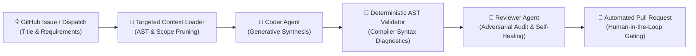

# Autonomous Multi-Agent Software Engineering Incubator

An event-driven, autonomous software engineering platform that orchestrates multi-agent LLM workflows to design, implement, verify, and review full-stack applications and modular features directly through GitHub Actions.

---

## System Overview

The **Autonomous Software Engineering Incubator** translates natural-language requirements into production-ready pull requests with zero human intervention during code generation. Tasks dispatched via GitHub Issues or manual workflow triggers initiate a cloud-native **Generator-Critic (Maker-Checker)** multi-agent pipeline that scopes context, generates modular implementations in isolated vertical slices, runs deterministic AST validation, and opens a structured, audited Pull Request for human review.



---

## Key Architectural Pillars

### 1. Dual-Agent Generator-Critic Pipeline
Rather than relying on a single prompt vulnerable to confirmation bias, the architecture strictly decouples implementation from critique:
- **Coder Agent** (`temperature=0.2`): Synthesizes modular application components, vertical slices, or incremental updates based on scoped context.
- **Reviewer Agent** (`temperature=0.1`): Adopts an adversarial Senior Staff Engineer persona to audit React hooks, lifecycle dependencies, error boundaries, and architectural guidelines.

### 2. Neuro-Symbolic Verification (AST Compiler Diagnostics)
LLMs are probabilistic and prone to hallucinating valid syntax or dropping matching brackets. Between generation and review, a deterministic static analyzer (`ast.parse` for Python and strict JSON parsers) evaluates candidate code:
- If a syntax error is discovered, the exact compiler diagnostic and line number are captured and passed directly to the Reviewer Agent.
- The Reviewer Agent uses this deterministic ground truth to perform **targeted self-healing**, eliminating compile regressions before commits are made.

### 3. Targeted Context Scoper (Token & Latency Optimization)
To avoid polluting the context window with the entire repository, `ContextLoader`:
- Automatically identifies whether a task targets an existing application slice or requires greenfield scaffolding.
- Prunes build artifacts (`node_modules`, `dist`, `__pycache__`) and extracts only relevant architectural contracts and dependent source files.
- Slashing token overhead ensures fast, cost-effective, and predictable execution on CI runners.

### 4. Human-in-the-Loop (HITL) Gating
No autonomous code merges directly into `main`. All generated changes are submitted via Pull Requests that include:
- Markdown changelogs and verification notes generated by the Reviewer Agent.
- Automated CI test suite evaluation.
- Final human engineer sign-off and merge control.

---

## Incubated Application: Local-First Research Assistant

To demonstrate the incubator's end-to-end capability on complex software, the multi-agent system scaffolded and iteratively built **`desktop_app_local_first_resear`**—a local-first academic paper workspace and PDF reader:

- **Local-First Architecture**: Built with React, Vite, Electron, and Tailwind CSS using browser-native storage (zero cloud database dependency).
- **3-Tier Outline & Section Extraction**: Cascading fallback across embedded PDF outlines, digital text regex parsing, and client-side Tesseract OCR.
- **Dwell-Time Reading Tracker**: Background observer tracking active dwell times on individual sections to automatically update reading progress.
- **In-Viewer Active Recall Flashcards**: In-modal flashcard capture shortcut (`⌘+K` / `Ctrl+K`) with context tagging and spaced-repetition tracking.
- **Notion-Styled Aesthetic**: Warm paper canvas (`#fbfbfa`), stone neutrals, and clean distraction-free typography.

---

## Repository Layout

```text
├── .github/workflows/
│   ├── agent_pipeline.yml      # GitHub Actions autonomous multi-agent runner
│   └── test.yml                # Automated CI test runner on PRs
├── pipeline/
│   ├── run_agents.py           # Multi-agent orchestrator (Coder + Reviewer + AST)
│   ├── context_loader.py       # Scoped context extraction engine
│   └── local_test_runner.py    # Zero-quota offline simulation runner
├── apps/
│   └── desktop_app_local_first_resear/ # Incubated Electron/React research app
├── src/
│   ├── core/                   # Extensible CLI plugin architecture & registry
│   └── features/               # Isolated vertical-slice CLI plugins
├── tests/                      # Automated unit test suite
├── ARCHITECTURE.md             # Repository contracts & system guidelines
└── main.py                     # CLI entry point
```

---

## Quickstart

### 1. GitHub Configuration
To enable the autonomous agent pipeline via GitHub Actions:
1. Store a Gemini API key in GitHub:
   - **Repository Settings** $\rightarrow$ **Secrets and variables** $\rightarrow$ **Actions** $\rightarrow$ **New repository secret**.
   - Name: `GEMINI_API_KEY`.
2. Grant workflow permissions:
   - **Settings** $\rightarrow$ **Actions** $\rightarrow$ **General** $\rightarrow$ **Workflow permissions**:
   - Select **Read and write permissions** and check **Allow GitHub Actions to create and approve pull requests**.

### 2. Triggering Autonomous Development
- **Via GitHub Issue**: Create an issue describing the feature or application and attach the label `idea`.
- **Via Manual Dispatch**: Go to the **Actions** tab $\rightarrow$ select **Autonomous Multi-Agent Coder** $\rightarrow$ click **Run workflow** and supply a title and description.

### 3. Local Development & Simulation
Run the automated test suite or simulate the agent wiring offline without consuming API quota:

```bash
# Run unit test suite
python3 -m unittest discover tests

# Or if pytest is installed
pytest tests/ -v

# Run the agent pipeline in offline mock mode (no API key required)
python3 pipeline/local_test_runner.py

# Run the live pipeline locally (requires GEMINI_API_KEY)
export GEMINI_API_KEY="your-key-here"
python3 pipeline/run_agents.py
```
